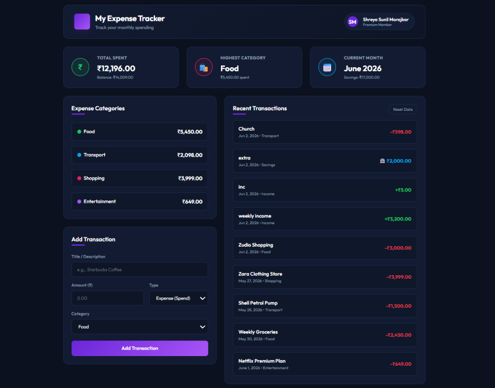

# Personal Expense Tracker Dashboard 💸

A clean, premium, and structured frontend user interface for a **Personal Expense Tracker Dashboard** built using **100% pure HTML5 and CSS3**.

This project focuses on core layout concepts, demonstrating absolute mastery over the **CSS Box Model**, **display properties**, and **Flexbox** without utilizing JavaScript, CSS Grid, or external CSS frameworks.

---

## 📸 Dashboard Preview

---

## ✨ Features Implemented

1. **Header Section**:
   * Application Title: `My Expense Tracker`
   * Subtitle: `Track your monthly spending`
   * Clean spacing, aligned user profile badge, and dynamic HSL color branding.
2. **Horizontal Summary Cards (Flexbox)**:
   * **Total Spent**: Displays the total expenditure against a target budget using a fluid **Pure CSS Progress Bar** (loads from 0% to 61% via CSS Keyframe animations).
   * **Highest Category**: Highlight card indicating the category with the peak transaction values (`Food`).
   * **Current Month**: Indicates the active tracker period (`June 2026`) and active savings goal.
3. **Expense Categories Section**:
   * Vertical list of key spending groups (`Food`, `Transport`, `Shopping`, `Entertainment`).
   * Left-aligned text details and right-aligned amounts using Flexbox space-between layout.
4. **Recent Transactions Section**:
   * Lists expense entries formatted as cards containing the description, date, category tag, and price.
5. **Interactive Category Filtering (100% Pure CSS - No JS)**:
   * Powered by the **CSS Radio hack** (`input[name="tx-filter"]` and sibling selectors `~`). Clicking on filter controls instantly changes display properties of cards matching categories with zero lag.
6. **Pure CSS Donut Chart**:
   * A beautiful categories breakdown donut chart created with a circular `conic-gradient` mask and a custom side-by-side color legend.

---

## 🛠️ Tech Stack & Constraints Met

* **HTML5**: Semantic tags structure (`<header>`, `<main>`, `<section>`).
* **CSS3**: Variables (custom HSL color palette), keyframe animations, Flexbox layout, pseudo-elements, and sibling selectors.
* **No JavaScript**: Zero scripts or behavioral handlers.
* **No Grid**: Layout structured strictly with Flexbox.
* **No Frameworks**: Native, vanilla styling from scratch.

---

## 📂 Project Submission Structure

Inside the submission package:
* `index.html` - Static HTML source.
* `style.css` - Custom styling stylesheet.
* `index.txt` - Notepad duplicate of HTML source code.
* `style.txt` - Notepad duplicate of CSS source code.
* `dashboard_screenshot.png` - Visual output screenshot.
* `github_link.txt` - Link to this public repository.
